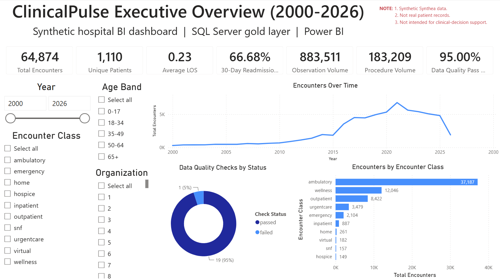
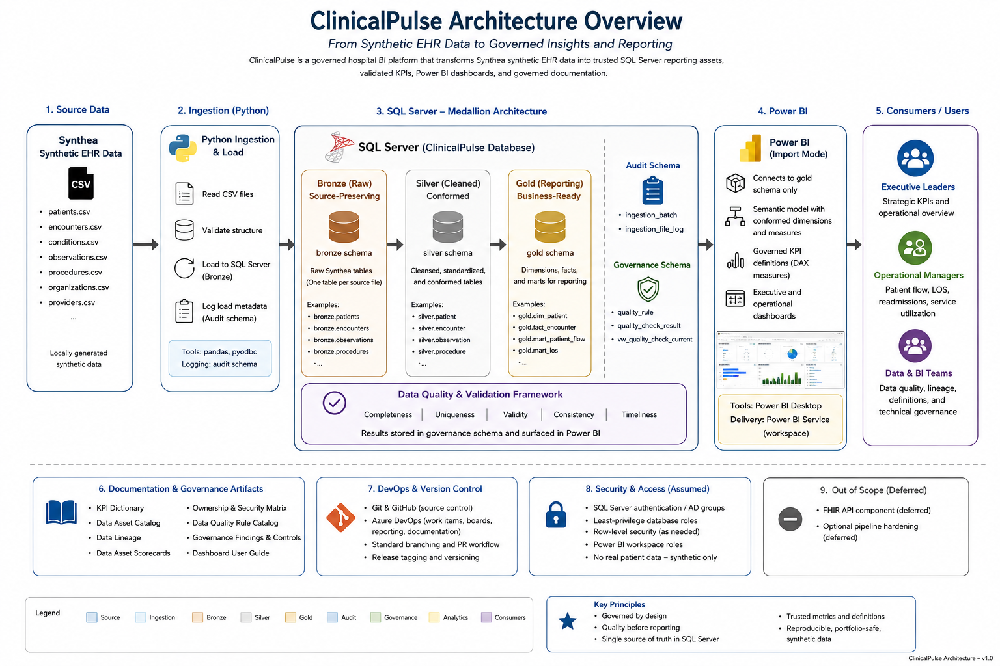

# ClinicalPulse

**A governed hospital business intelligence platform built with synthetic EHR data, SQL Server, Python, and Power BI.**

ClinicalPulse demonstrates how a hospital analytics team can transform source healthcare data into trusted reporting assets. The project combines medallion-style data engineering, dimensional modeling, governed KPI definitions, data quality controls, lineage, and stakeholder-facing Power BI dashboards.

> ClinicalPulse uses synthetic Synthea data. It does not contain real patient records, represent real hospital performance, provide clinical evidence, or support clinical decision-making.



## Project Thesis

Hospital leaders need reliable visibility into patient flow, encounter activity, length of stay, readmissions, service utilization, observation workload, and reporting quality. Those metrics are only useful when their definitions, source logic, data quality dependencies, and limitations are clear.

ClinicalPulse addresses that problem by treating governance as part of the analytical system rather than as documentation added after development. Source records are ingested and audited, standardized through SQL Server data layers, modeled into reporting-ready facts and dimensions, validated against governed KPI logic, and presented through a documented Power BI semantic model.

## Business Questions

ClinicalPulse supports analysis of:

- encounter volume and patient-flow trends
- average and median length of stay
- 30-day readmission patterns
- condition mix and procedure utilization
- lab-like and clinical observation activity
- data quality status and reporting trust
- asset ownership, lineage, readiness, and portfolio safety

## Architecture



Power BI connects only to SQL Server gold-layer assets. Raw CSV files, bronze tables, and silver tables are not used directly by the reporting model.

## Implemented Stack

| Technology | Role |
|---|---|
| Synthea | Generates synthetic EHR-like source data |
| SQL Server and T-SQL | Provides bronze, silver, gold, governance, and audit layers |
| Python | Automates source ingestion, reconciliation, and quality-check execution |
| Power BI, Power Query, and DAX | Delivers the semantic model, governed measures, and dashboards |
| Git and GitHub | Provide version control and public portfolio delivery |
| Azure DevOps Boards | Tracks epics, features, user stories, tasks, and delivery evidence |

## Data Platform

### Source and ingestion

Seven Synthea CSV entities are ingested into SQL Server:

- patients
- encounters
- conditions
- observations
- procedures
- organizations
- providers

The ingestion process records batch status, file-level row counts, source filenames, timestamps, and lineage metadata. Raw generated data remains local and is excluded from Git.

### Medallion-style SQL Server layers

| Layer | Purpose |
|---|---|
| Bronze | Preserves source structure and adds ingestion metadata |
| Silver | Applies business-friendly naming, type conversion, derived fields, validation flags, and lineage preservation |
| Gold | Provides star-schema dimensions, facts, and reporting marts for governed analysis |
| Governance | Stores quality-rule definitions and persisted quality-check results |
| Audit | Stores ingestion batches, file logs, and reconciliation evidence |

The gold layer contains **20 reporting objects**:

- 8 dimensions
- 6 fact tables
- 6 reporting marts

These assets support encounter, patient-flow, length-of-stay, readmission, condition, procedure, observation, and reporting-trust analysis.

## Power BI Reporting

The Power BI report uses a documented gold-layer semantic model, a shared date dimension, controlled relationships, and governed DAX measures.

### Dashboard pages

| Page | Purpose |
|---|---|
| Executive Overview | Summarizes operational KPIs, encounter trends, encounter-class mix, and reporting trust |
| Patient Flow | Examines encounter volume, patient mix, age bands, and encounter classes |
| Length of Stay | Compares average and median LOS, long-stay indicators, and encounter-class patterns |
| Readmissions | Presents 30-day readmission counts, rates, eligibility, timing, and encounter-class comparisons |
| Conditions & Procedures | Explores case mix, procedure utilization, and volume trends |
| Lab / Observation Operations | Examines observation workload, high-volume codes, categories, and trends |
| Data Quality & Governance | Makes quality status, failed checks, KPI documentation, and asset readiness visible |

See the [dashboard walkthrough](docs/dashboard_walkthrough.md) for screenshot-by-screenshot interpretation.

## Governance and Reporting Trust

ClinicalPulse includes governance artifacts that connect business meaning to implementation evidence:

| Artifact | Purpose |
|---|---|
| [Project charter](docs/project_charter.md) | Defines the platform vision, scope, users, assumptions, and success criteria |
| [Business requirements](docs/business_requirements.md) | Connects stakeholder needs to reporting requirements |
| [Stakeholder matrix](docs/stakeholder_matrix.md) | Defines modeled ownership, stewardship, and user roles |
| [KPI dictionary](docs/kpi_dictionary.md) | Defines metric meaning, formulas, grain, sources, exclusions, dependencies, and limitations |
| [Data governance plan](docs/data_governance_plan.md) | Defines governance practices and responsibilities |
| [Data asset catalog](docs/data_asset_catalog.md) | Catalogs analytical and reporting assets |
| [Data asset scorecards](docs/data_asset_scorecards.md) | Rates reliability, documentation, validation, safety, and adoption readiness |
| [Data lineage](docs/data_lineage.md) | Traces source data through SQL transformations and Power BI measures |
| [Security model](docs/security_model.md) | Documents least-privilege and public-portfolio safety assumptions |
| [Power BI validation log](docs/powerbi_validation_log.md) | Reconciles DAX measures against SQL outputs |
| [Report design checklist](docs/report_design_checklist.md) | Records readability, accessibility, UX, and safety review |

### Validation approach

Reporting trust is supported through:

- source-to-bronze row-count reconciliation
- typed and quality-aware silver transformations
- completeness, uniqueness, validity, consistency, freshness, lineage, and referential-integrity checks
- SQL validation queries for governed KPIs
- DAX-to-SQL measure reconciliation
- visible documentation of known quality findings rather than silent suppression

A known duplicate-observation finding remains documented because transparency is more valuable than presenting an artificially perfect quality result.

## Repository Guide

```text
clinical-pulse-healthcare-bi/
|-- README.md
|-- docs/                 Governance, lineage, requirements, validation, and user documentation
|-- sql/                  Database creation, schemas, transformations, quality checks, and KPI queries
|-- src/                  Python ingestion, reconciliation, and quality-check utilities
|-- powerbi/
|   |-- screenshots/      Public, aggregate dashboard evidence
|   |-- measure_definitions.md
|   `-- semantic_model_notes.md
|-- azure-devops/         Backlog and delivery-planning artifacts
`-- data/                 Local data folders; raw generated files are excluded from Git
```

## How to Review the Project

A reviewer can follow the project from business problem to dashboard evidence in this order:

1. Read the [project charter](docs/project_charter.md) and [business requirements](docs/business_requirements.md).
2. Review the SQL scripts under [`sql/`](sql/) to see the ingestion and bronze-to-silver-to-gold implementation.
3. Review the [KPI dictionary](docs/kpi_dictionary.md), [data lineage](docs/data_lineage.md), and [asset scorecards](docs/data_asset_scorecards.md).
4. Review the [semantic model notes](powerbi/semantic_model_notes.md) and [measure definitions](powerbi/measure_definitions.md).
5. Open the [dashboard walkthrough](docs/dashboard_walkthrough.md) and the screenshots under [`powerbi/screenshots/`](powerbi/screenshots/).
6. Review the [Power BI validation log](docs/powerbi_validation_log.md) and [report design checklist](docs/report_design_checklist.md).

## Public Portfolio Safety

- All healthcare data used by the project is synthetic.
- Raw generated files, local database backups, credentials, environment files, and connection strings are excluded from Git.
- The local Power BI `.pbix` file is not committed; aggregate screenshots provide public evidence.
- Reporting assets avoid unnecessary direct-identifier-style fields and row-level patient-like detail.
- Results must not be interpreted as clinical evidence, real hospital performance, or clinical recommendations.

## Assumptions and Limitations

- Synthea data simulates healthcare activity and does not reproduce the operational complexity of a real hospital.
- The readmission model uses simplified 30-day encounter sequencing and does not reliably distinguish planned from unplanned readmissions.
- Observation data contains both lab-like and other clinical observations, and a known duplicate-record finding affects raw volume interpretation.
- Static screenshots do not reproduce all Power BI filtering and interaction behavior.
- The project is implemented as a local SQL Server and Power BI portfolio environment rather than a production deployment.
- The current release focuses on governed hospital BI; it does not include a FHIR API, clinical decision-support functionality, or optional CI/CD pipeline hardening.

## Project Value

ClinicalPulse demonstrates the ability to:

- translate hospital operational questions into governed analytical requirements
- build reproducible SQL Server data layers from synthetic source data
- design reporting-ready facts, dimensions, and marts
- implement and reconcile KPI logic across SQL and DAX
- surface data quality and governance alongside operational metrics
- communicate technical implementation clearly to business, governance, and portfolio reviewers
- deliver work through disciplined Git and Azure DevOps practices

## License and Use

ClinicalPulse is a portfolio and learning project. Any reuse should preserve the synthetic-data disclaimer and should not imply real clinical, operational, or production-hospital validity.
