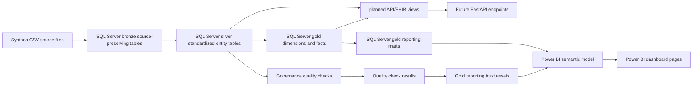

# ClinicalPulse Data Lineage Document

## 1. Purpose

This document explains how ClinicalPulse data flows from synthetic Synthea source files into SQL Server bronze, silver, and gold layers, then into Power BI reporting assets and planned API/FHIR demonstration outputs.

The goal is to make reporting lineage traceable for data stewards, BI developers, reviewers, and portfolio stakeholders.

ClinicalPulse uses synthetic Synthea data. Assets documented here are not real patient records and should not be interpreted as real hospital performance, clinical evidence, or clinical recommendations. This document is not intended for clinical-decision support.

## 2. Artifact Traceability

| Field | Value |
|---|---|
| Azure Boards user story | AB#1569 - Create data lineage document |
| Parent area | ClinicalPulse\Data Quality & Governance |
| Iteration | ClinicalPulse\Sprint 6 - Power BI Reporting |
| Primary deliverable | `docs/data_lineage.md` |
| Validation support | `src/validate_data_lineage_ab1571.py` |
| Related task | AB#1570 - Draft/build artifact for Create data lineage document |
| Validation task | AB#1571 - Validate and document Create data lineage document |

## 3. Lineage Scope

This lineage document covers:

- Synthea CSV source files
- SQL Server bronze source-preserving tables
- SQL Server silver standardized entity tables
- SQL Server gold dimensions, facts, and marts
- KPI validation and Power BI measure lineage
- planned Power BI dashboard page lineage
- planned API/FHIR views and demonstration lineage
- assumptions and limitations affecting traceability

This document is asset-level lineage, not a full column-level lineage catalog.

## 4. End-to-End Lineage Overview

## 5. Layer Responsibilities

| Layer | Responsibility | Reporting use |
|---|---|---|
| Source | Synthetic Synthea CSV files generated or stored locally. | Not used directly for reporting. |
| Bronze | Source-preserving SQL Server tables with ingestion metadata. | Not used directly for Power BI. |
| Silver | Cleaned, typed, standardized, lineage-preserving business entities. | Supports gold transformation and data quality validation. |
| Gold | Star-schema-friendly dimensions, facts, and marts. | Primary source for Power BI semantic model and KPI reporting. |
| Governance / Audit | Quality rules, persisted validation results, ingestion logs, and reconciliation evidence. | Supports reporting trust and data governance dashboarding. |
| Power BI | Semantic model, DAX measures, and dashboard pages. | Stakeholder-facing reporting layer. |
| API / FHIR | Planned FHIR-aligned views and future FastAPI endpoints. | Interoperability demonstration, not production FHIR server scope. |

## 6. Source-to-Bronze-to-Silver-to-Gold Lineage

| Source entity | Source file | Bronze asset | Silver asset | Gold dimension asset | Gold fact / mart assets | Power BI usage | Planned API/FHIR usage |
|---|---|---|---|---|---|---|---|
| Patients | `patients.csv` | `bronze.patients` | `silver.patient` | `gold.dim_patient` | Used by encounter, readmission, condition, observation, and procedure facts through patient keys | Patient slicers, unique patients, age-band analysis, readmissions, patient flow | Planned `api.vw_fhir_patient`; future Patient resource |
| Encounters | `encounters.csv` | `bronze.encounters` | `silver.encounter` | `gold.dim_encounter_class`, `gold.dim_date`, lightweight `gold.dim_organization`, lightweight `gold.dim_provider` | `gold.fact_encounter`, `gold.fact_readmission`, `gold.mart_patient_flow`, `gold.mart_length_of_stay`, `gold.mart_readmissions` | Total encounters, LOS, encounter trends, readmission rate, organization and class slicing | Planned `api.vw_fhir_encounter`; future Encounter resource |
| Conditions | `conditions.csv` | `bronze.conditions` | `silver.condition` | `gold.dim_condition` | `gold.fact_condition`, readmission and case-mix reporting context | Conditions & Procedures page, readmission breakdowns, case-mix context | Planned `api.vw_fhir_condition`; future Condition resource |
| Observations | `observations.csv` | `bronze.observations` | `silver.observation` | `gold.dim_observation` | `gold.fact_observation`, `gold.mart_lab_operations` | Observation volume, lab/observation activity, top observation codes | Planned `api.vw_fhir_observation`; future Observation resource |
| Procedures | `procedures.csv` | `bronze.procedures` | `silver.procedure` | `gold.dim_procedure` | `gold.fact_procedure`, `gold.mart_service_utilization` | Procedure volume, utilization analysis, Conditions & Procedures page | Future Procedure mapping candidate |
| Organizations | `organizations.csv` | `bronze.organizations` | Not currently implemented as a dedicated silver table | Lightweight `gold.dim_organization` derived from encounter organization references | Used by encounter-related facts and marts | Organization slicers and operational grouping | Future Organization mapping candidate |
| Providers | `providers.csv` | `bronze.providers` | Not currently implemented as a dedicated silver table | Lightweight `gold.dim_provider` derived from encounter provider references | Optional provider context for encounter reporting | Optional provider-level slicing if used | Future Practitioner / PractitionerRole mapping candidate |

## 7. Bronze-to-Silver Transformation Lineage

| Silver asset | Upstream bronze asset | Transformation summary | Lineage fields preserved |
|---|---|---|---|
| `silver.patient` | `bronze.patients` | Standardizes patient identifiers, dates, demographics, geography, age fields, deceased flag, and reporting-safe patient attributes. | `bronze_ingestion_batch_id`, `bronze_ingestion_datetime`, `bronze_source_file`, `bronze_row_hash`, `bronze_load_status` |
| `silver.encounter` | `bronze.encounters` | Parses encounter start/stop timestamps, derives encounter dates, duration fields, LOS fields, quality flags, cost fields, and encounter class. | `bronze_ingestion_batch_id`, `bronze_ingestion_datetime`, `bronze_source_file`, `bronze_row_hash`, `bronze_load_status` |
| `silver.condition` | `bronze.conditions` | Converts condition dates, standardizes patient and encounter references, derives condition duration, condition category, status, and quality flags. | `bronze_ingestion_batch_id`, `bronze_ingestion_datetime`, `bronze_source_file`, `bronze_row_hash`, `bronze_load_status` |
| `silver.observation` | `bronze.observations` | Parses observation timestamps, standardizes category and code fields, preserves raw values, derives numeric values where possible, and applies quality flags. | `bronze_ingestion_batch_id`, `bronze_ingestion_datetime`, `bronze_source_file`, `bronze_row_hash`, `bronze_load_status` |
| `silver.procedure` | `bronze.procedures` | Parses procedure timestamps, derives procedure dates/durations, standardizes codes, categories, costs, reason fields, and quality flags. | `bronze_ingestion_batch_id`, `bronze_ingestion_datetime`, `bronze_source_file`, `bronze_row_hash`, `bronze_load_status` |

## 8. Silver-to-Gold Transformation Lineage

| Gold asset | Upstream silver / governance assets | Transformation purpose | Downstream use |
|---|---|---|---|
| `gold.dim_patient` | `silver.patient` | Reporting-safe patient dimension with demographic and age-band attributes. | Patient slicers, unique patient counts, age-band reporting |
| `gold.dim_date` | Generated date logic from reporting date ranges | Calendar dimension for consistent date filtering. | Date slicers and time-series visuals |
| `gold.dim_organization` | `silver.encounter` organization references | Lightweight organization dimension based on encounter-linked organization IDs. | Organization slicers and operational grouping |
| `gold.dim_provider` | `silver.encounter` provider references | Lightweight provider dimension based on encounter-linked provider IDs. | Optional provider grouping |
| `gold.dim_encounter_class` | `silver.encounter` | Encounter class dimension and reporting grouping. | Encounter class slicers and patient-flow reporting |
| `gold.dim_condition` | `silver.condition` | Condition dimension with codes, descriptions, and categories. | Case-mix and readmission context |
| `gold.dim_observation` | `silver.observation` | Observation dimension with codes, descriptions, categories, and units. | Lab / Observation Operations reporting |
| `gold.dim_procedure` | `silver.procedure` | Procedure dimension with codes, descriptions, and categories. | Conditions & Procedures and utilization reporting |
| `gold.fact_encounter` | `silver.encounter`, gold dimensions | Encounter-grain fact table for volume, LOS, cost, organization, provider, class, patient, and date analysis. | Executive Overview, Patient Flow, LOS, Readmissions |
| `gold.fact_readmission` | `silver.encounter`, `gold.fact_encounter` | Index-encounter-level readmission logic. | Readmissions dashboard and readmission KPI |
| `gold.fact_condition` | `silver.condition`, `gold.dim_condition`, `gold.dim_patient` | Condition-grain fact table for diagnosis/case-mix context. | Conditions & Procedures and readmission context |
| `gold.fact_observation` | `silver.observation`, `gold.dim_observation`, `gold.dim_patient` | Observation-grain fact table for lab and clinical observation activity. | Lab / Observation Operations |
| `gold.fact_procedure` | `silver.procedure`, `gold.dim_procedure`, `gold.dim_patient` | Procedure-grain fact table for service utilization. | Conditions & Procedures and utilization reporting |
| `gold.fact_data_quality_issue` | `governance.quality_check_result`, `governance.quality_rule` | Reporting fact for persisted quality results. | Data Quality & Governance dashboard |
| `gold.mart_patient_flow` | `gold.fact_encounter`, gold dimensions | Dashboard-ready patient-flow reporting mart. | Patient Flow page |
| `gold.mart_length_of_stay` | `gold.fact_encounter`, gold dimensions | Dashboard-ready LOS reporting mart. | Executive Overview and Patient Flow |
| `gold.mart_readmissions` | `gold.fact_readmission`, `gold.fact_encounter`, gold dimensions | Dashboard-ready readmission reporting mart. | Readmissions page |
| `gold.mart_lab_operations` | `gold.fact_observation`, gold dimensions | Dashboard-ready observation/lab activity mart. | Lab / Observation Operations page |
| `gold.mart_service_utilization` | `gold.fact_procedure`, gold dimensions | Dashboard-ready procedure/utilization mart. | Conditions & Procedures page |
| `gold.mart_reporting_trust` | `gold.fact_data_quality_issue`, governance quality assets | Dashboard-ready reporting trust mart. | Data Quality & Governance page |

## 9. KPI Lineage

| KPI | Source lineage | SQL reporting asset | Planned Power BI measure | Planned dashboard usage | Validation lineage |
|---|---|---|---|---|---|
| Total Encounters | `encounters.csv` -> `bronze.encounters` -> `silver.encounter` -> `gold.fact_encounter` | `gold.fact_encounter`, `gold.mart_patient_flow` | `Total Encounters` | Executive Overview; Patient Flow | SQL KPI validation query reconciles eligible encounter count. |
| Unique Patients | `patients.csv` and `encounters.csv` -> `silver.patient`, `silver.encounter` -> `gold.dim_patient`, `gold.fact_encounter` | `gold.fact_encounter`, `gold.dim_patient` | `Unique Patients` | Executive Overview; Patient Flow | SQL validation distinct-counts patient keys in eligible encounter scope. |
| Average Length of Stay | `encounters.csv` -> `bronze.encounters` -> `silver.encounter` duration fields -> `gold.fact_encounter` | `gold.mart_length_of_stay` | `Average LOS` | Executive Overview; Patient Flow | SQL validation recalculates average LOS from gold LOS asset. |
| Median Length of Stay | `encounters.csv` -> `bronze.encounters` -> `silver.encounter` duration fields -> `gold.fact_encounter` | `gold.mart_length_of_stay` | `Median LOS` | Executive Overview; Patient Flow | SQL validation recalculates median LOS from gold LOS asset. |
| 30-Day Readmission Rate | `encounters.csv` -> `silver.encounter` encounter sequencing -> `gold.fact_readmission` | `gold.fact_readmission`, `gold.mart_readmissions` | `30-Day Readmission Rate` | Executive Overview; Readmissions | SQL validation reconciles readmission numerator, denominator, and rate. |
| Observation Volume | `observations.csv` -> `bronze.observations` -> `silver.observation` -> `gold.fact_observation` | `gold.fact_observation`, `gold.mart_lab_operations` | `Observation Volume` | Executive Overview; Lab / Observation Operations | SQL validation reconciles eligible observation count. |
| Procedure Volume | `procedures.csv` -> `bronze.procedures` -> `silver.procedure` -> `gold.fact_procedure` | `gold.fact_procedure`, `gold.mart_service_utilization` | `Procedure Volume` | Conditions & Procedures | SQL validation reconciles eligible procedure count. |
| Data Quality Pass Rate | `governance.quality_rule`, `governance.quality_check_result` -> `gold.fact_data_quality_issue` | `gold.mart_reporting_trust` | `Data Quality Pass Rate` | Executive Overview; Data Quality & Governance | SQL validation recalculates pass/fail counts and pass rate from governance results. |
| API Resource Coverage | Future FHIR mapping and API view assets | Planned API/FHIR assets | `API Resource Coverage` | FHIR API Demonstration; Data Quality & Governance | Current expected state is pending/not implemented until API scope is built. |

## 10. Power BI Dashboard Lineage

Power BI should connect to gold schema tables/views, not raw source files, bronze tables, or unmanaged CSV extracts.

| Dashboard page | Primary upstream assets | KPI / analytic lineage |
|---|---|---|
| Executive Overview | `gold.fact_encounter`, `gold.fact_readmission`, `gold.fact_observation`, `gold.mart_length_of_stay`, `gold.mart_reporting_trust` | Total encounters, unique patients, average LOS, median LOS, readmission rate, observation volume, data quality score |
| Patient Flow | `gold.mart_patient_flow`, `gold.mart_length_of_stay`, `gold.dim_date`, `gold.dim_encounter_class`, `gold.dim_organization`, `gold.dim_patient` | Encounter volume trends, LOS distribution, encounter class breakdowns, organization and age-band filtering |
| Readmissions | `gold.mart_readmissions`, `gold.fact_readmission`, `gold.dim_patient`, `gold.dim_condition`, `gold.dim_organization`, `gold.dim_date` | Readmission count/rate, days to readmission, readmission by patient group and condition context |
| Conditions & Procedures | `gold.fact_condition`, `gold.fact_procedure`, `gold.dim_condition`, `gold.dim_procedure`, `gold.mart_service_utilization` | Condition mix, procedure volume, procedure category utilization |
| Lab / Observation Operations | `gold.fact_observation`, `gold.dim_observation`, `gold.mart_lab_operations`, `gold.dim_date`, `gold.dim_encounter_class` | Observation volume, top observation codes, category trends |
| Data Quality & Governance | `gold.fact_data_quality_issue`, `gold.mart_reporting_trust`, `governance.quality_rule`, `governance.quality_check_result` | Quality rule status, pass/fail counts, reporting trust indicators |
| FHIR API Demonstration | Planned `api.vw_fhir_patient`, `api.vw_fhir_encounter`, `api.vw_fhir_observation`, `api.vw_fhir_condition`, future API docs and screenshots | API resource coverage and FHIR-aligned demonstration status |

## 11. Planned API / FHIR Lineage

The API/FHIR component is planned future scope. Its lineage is documented here to show intended traceability, not current API completion.

| Planned API asset | Upstream ClinicalPulse assets | FHIR-aligned resource | Intended endpoint usage | Current status |
|---|---|---|---|---|
| `api.vw_fhir_patient` | `silver.patient`, `gold.dim_patient` | Patient | `GET /fhir/Patient/{patient_id}` | Planned / not implemented |
| `api.vw_fhir_encounter` | `silver.encounter`, `gold.fact_encounter` | Encounter | `GET /fhir/Encounter/{encounter_id}` | Planned / not implemented |
| `api.vw_fhir_observation` | `silver.observation`, `gold.fact_observation` | Observation | `GET /fhir/Observation?patient={patient_id}` | Planned / not implemented |
| `api.vw_fhir_condition` | `silver.condition`, `gold.fact_condition` | Condition | `GET /fhir/Condition?patient={patient_id}` | Planned / not implemented |

API outputs should expose only selected synthetic demonstration records and should clearly state that the API is FHIR-aligned, not a certified production FHIR server.

## 12. Quality and Validation Lineage

| Validation area | Upstream assets | Validation output | Downstream usage |
|---|---|---|---|
| Bronze ingestion reconciliation | Synthea CSV files, `audit.ingestion_batch`, `audit.ingestion_file_log`, bronze tables | Row-count and load-status evidence | Supports ingestion trust and reproducibility |
| Silver quality checks | Silver tables, `governance.quality_rule`, `governance.vw_quality_check_current` | Persisted results in `governance.quality_check_result` | Supports data quality reporting and gold quality issue fact |
| Gold validation | Silver tables, gold facts, gold dimensions, gold marts | Gold-layer validation script results | Confirms gold is ready for Power BI |
| KPI validation | Gold facts and marts, SQL KPI validation queries | KPI validation log and reconciled SQL outputs | Baseline for DAX measure validation |
| Power BI validation | Power BI measures, SQL validation outputs | Planned dashboard validation evidence | Confirms dashboard numbers match governed SQL logic |
| API readiness validation | Planned API/FHIR views and endpoint tests | Future API validation evidence | Confirms FHIR-style outputs are structurally valid and portfolio-safe |

## 13. Known Lineage Notes

- Bronze tables preserve source-like structures and ingestion metadata.
- Silver tables standardize naming, data types, quality flags, and lineage fields.
- Gold tables and marts are the reporting-ready layer.
- Power BI should use gold assets as its source layer.
- KPI definitions should remain aligned with SQL validation outputs before being implemented as DAX measures.
- The observation duplicate finding is retained as a governed data-quality finding and should be considered when reporting observation volume.
- API/FHIR assets are planned and should not be treated as failed Sprint 6 reporting deliverables.

## 14. Assumptions

- ClinicalPulse uses synthetic Synthea data only.
- SQL Server is the analytical backbone for all governed reporting assets.
- Gold tables and marts are the authoritative source for Power BI reporting.
- Power BI dashboards are planned from the gold layer and validated against SQL KPI outputs.
- API/FHIR assets are documented as planned because they belong to the broader ClinicalPulse architecture.
- Ownership and stewardship roles are modeled for portfolio and governance demonstration.
- This document traces assets and KPI paths at a practical project level, not at a complete field-by-field enterprise lineage level.

## 15. Limitations

- This document does not replace a full enterprise metadata catalog or automated lineage tool.
- Row-level lineage is represented through retained source identifiers and ingestion metadata, but this document does not enumerate every row-level relationship.
- Column-level lineage is summarized only where needed for KPI and asset traceability.
- Synthetic data should not be interpreted as real hospital activity, patient outcomes, or clinical evidence.
- Lightweight organization and provider dimensions are currently derived from encounter references, while richer organization/provider source files remain bronze reference assets.
- Planned API/FHIR lineage is included for traceability but is not evidence of completed API implementation.
